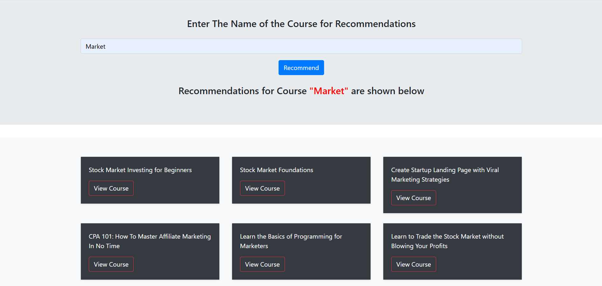
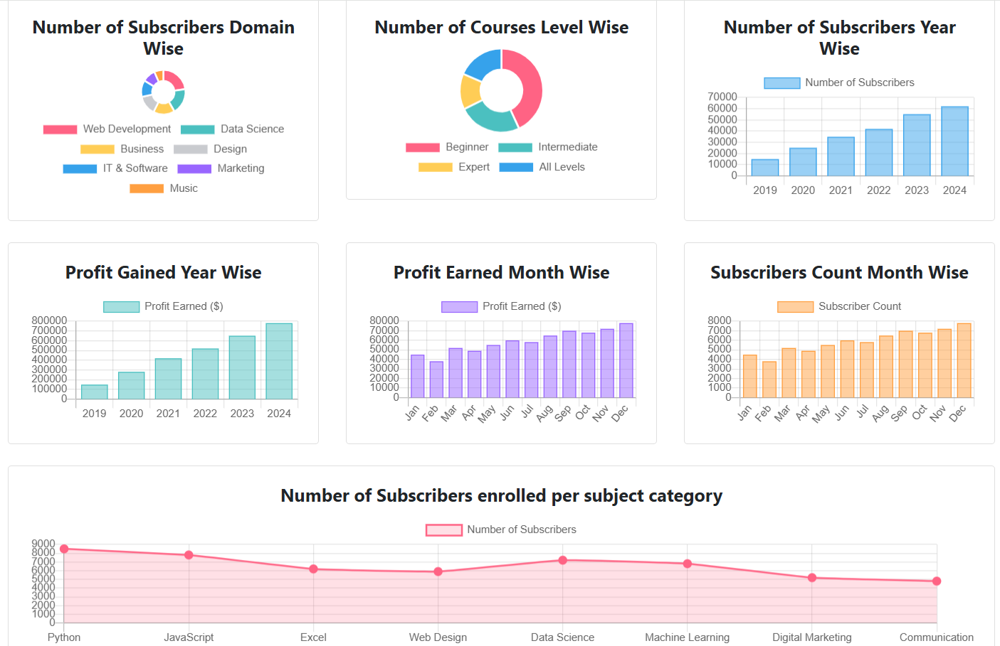

# 🎓 Course Recommendation System

This project is a **Course Recommendation System** that suggests similar courses based on a given course title using **Natural Language Processing (NLP)** and **Machine Learning (ML)** techniques. The system also includes a **dashboard** for insights into course data, including subscriber counts, profits, and distributions across levels and subjects.  

---

## 📁 Table of Contents
- [About the Project](#-about-the-project)
- [Features](#-features)
- [Tech Stack](#-tech-stack)
- [Installation](#-installation)
- [Usage](#-usage)
- [Data](#-data)
- [Project Structure](#-project-structure)
- [Screenshots](#-screenshots)
- [License](#-license)

---

## 📌 About the Project

The **Course Recommendation System** provides personalized course suggestions based on the user's input. It utilizes **text similarity** to find the closest matching courses. Additionally, it offers a data analytics dashboard to explore various statistics and trends in the course dataset.  

---

## ✅ Features

- 🔍 **Course Search**: Find courses related to user input using **Cosine Similarity**.
- 🎯 **Top Recommendations**: Get a list of similar courses with URLs, prices, and popularity metrics.
- 📊 **Analytics Dashboard**:
  - Course distributions by subject and level.
  - Year-wise and month-wise profit analysis.
  - Subscriber distribution insights.
- ⚙️ **Preprocessed Dataset** for clean and efficient querying.

---

## 💻 Tech Stack

- **Backend**: Python, Flask
- **Data Analysis**: Pandas, NumPy, NeatText
- **Machine Learning**: Scikit-learn
- **Visualization**: Seaborn, Matplotlib
- **Deployment**: Gunicorn (production server)

---

## 🔧 Installation

1. **Clone the repository**:
   ```bash
   git clone https://github.com/yourusername/Course-Recommendation-System.git
   cd Course-Recommendation-System
   ```

2. **Create and activate a virtual environment (optional but recommended)**:
   ```bash
   python -m venv venv
   source venv/bin/activate  # On Windows use: venv\Scripts\activate
   ```

3. **Install the dependencies**:
   ```bash
   pip install -r requirements.txt
   ```

4. **Run the Flask application**:
   ```bash
   python app.py
   ```

5. **Access the app**:
   Visit `http://127.0.0.1:5000/` in your browser.

---

## 🚨 Usage

- **Homepage**: Enter a course title to get similar course recommendations.
- **Dashboard**: Navigate to `/dashboard` for analytics on the course dataset.

---

## 📂 Data

- **Dataset Used**: `udemy_course_data.csv` (original), `UdemyCleanedTitle.csv` (processed)
- Columns include: `course_title`, `subject`, `level`, `num_subscribers`, `price`, `published_timestamp`, etc.

---

## 🗂️ Project Structure

```
├── app.py                        # Flask web application
├── dashboard.py                  # Data processing and visualization logic
├── Course_Recommendation_System.ipynb  # Course recommendation modeling notebook
├── EDA on UdemyDataset.ipynb     # Exploratory Data Analysis notebook
├── requirements.txt              # Python dependencies
├── Procfile                      # Deployment setup for Heroku/Gunicorn
├── LICENSE                       # License file
├── README.md                     # Project documentation
├── udemy_course_data.csv         # Original dataset
└── UdemyCleanedTitle.csv         # Preprocessed dataset
```

---

## 🗼️ Screenshots

### Course Recommendations Output



### Analytics Dashboard



---

## 📜 License

This project is licensed under the terms of the [MIT License](./LICENSE).

---

## 🙌 Acknowledgements

- **Udemy Dataset** — For providing the initial dataset.
- Open-source community for the tools and libraries used in this project.

---

## 📨 Contact

For any questions or suggestions, feel free to reach out at:  
📧 _akkiamit23@gmail.com_
